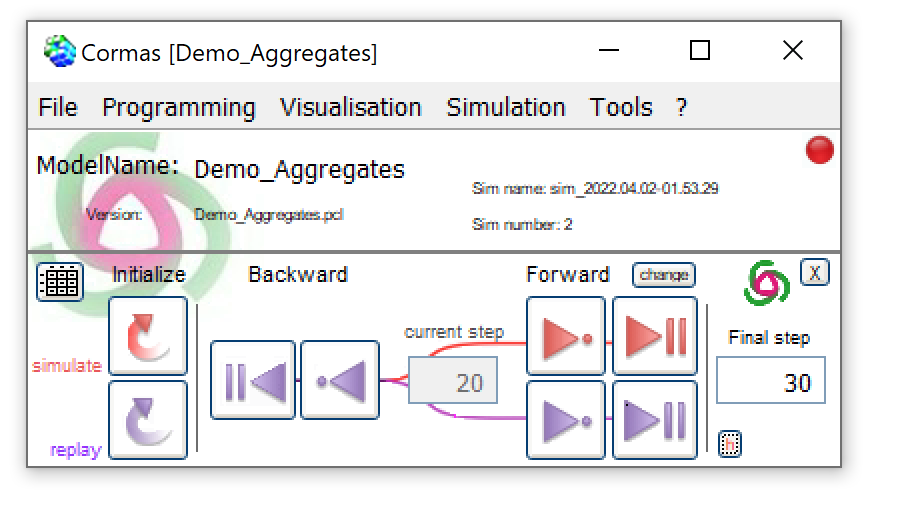
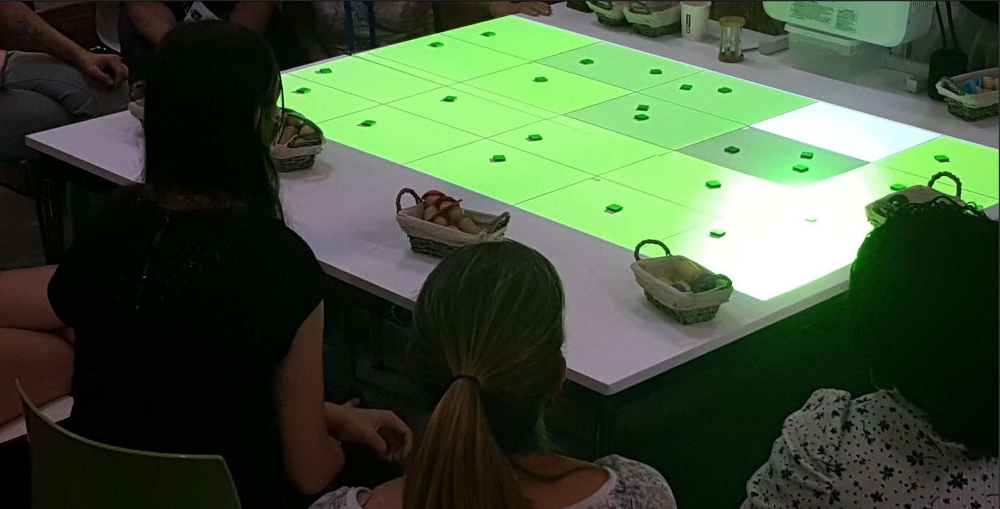

# Welcome to Cormas!

CORMAS is an Agent-Based Modelling (ABM) platform tailored preferentially to renewable resource management. Cormas is intended to facilitate the design of ABM, as well as monitor and analyse simulations. It is based on the VisualWorks programming environment which enables the development of models in Smalltalk. Cormas is a framework from which, by specialization and refining, users can create specific entities for their own model.

CORMAS is a free Open Source Software. Its last release (02/2023) [can be downloaded here](software).

On this site, you will also be able to access [application examples](models) (with a models library) and [publications](publications).

We propose a [Companion-Modelling approach (ComMod)](https://www.commod.org/en) based on a computer tool.

## Training Courses on Modelling

We are regularly delivering modelling [training courses](training).

The **MissABMS 2023** session  (**M**ulti-platform **I**nternational **S**ummer **S**chool on **A**gent-**B**ased **M**odeling & **S**imulation) will take place

- from **September 11 to 22, 2023** (2 weeks, in classroom) in Montpellier, France at [Agropolis International](https://www.agropolis.fr/MISS-ABMS-2023).
- By taking part in this course, you will gain a modelling culture and learn the different skills required for building agent-based models (ABMs) applied to sociological, ecological, or socio-ecological systems.
- **Key points**
    - MISS-ABMS is multi-cultural in terms of background and nationalities of the trainers and participants
    - MISS-ABMS promotes a collaborative practice of modelling and simulation
    - MISS-ABMS is multi-platform: [Cormas](), [Gama](https://gama-platform.org/) or [NetLogo](https://ccl.northwestern.edu/netlogo/index.shtml) can be choosen
    - MISS-ABMS presents the different stages of an ABM process, with a focus on model design and implementation
    - MISS-ABMS offers a significant time for group work to design and implement an ABM (see the [leaflet](http://cormas.cirad.fr/pdf/leaflet-miss-abms-2021.pdf) or watch the [presentation video](https://vimeo.com/254868269)).
- **For who**
    - Each year we enjoy having participants with very heterogeneous profiles in terms of age, nationality, scientific background and experience in modelling or coding. Beginners in ABM who are planning to participate in a modelling project in the months following the training are welcomed.
    - If you have any concern regarding your participation, feel free to ask at: miss-abms_organizers[at]agropolis[dot]fr
- **Information and registration**
    - For more details see the summer school website: <https://www.agropolis.fr/MISS-ABMS-2023>
    - If you intend to participate, please complete the [pre-registration form](https://www.agropolis.fr/MISS-ABMS-APPLICATION-FORM) by **May 31st, 2023**. The selection of participants and the confirmation of the session will be announced mid-July.